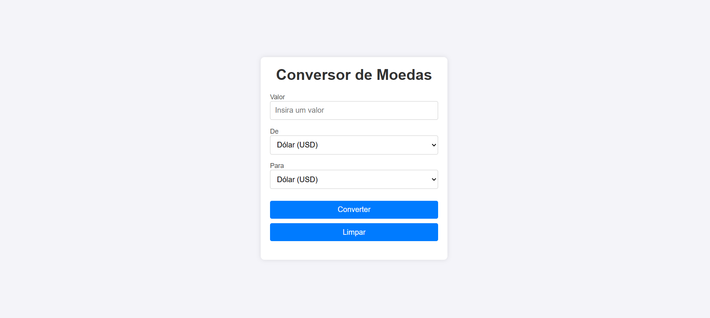
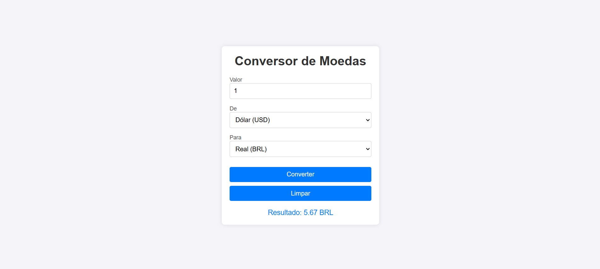

<h1 align="center">Projeto para conversão de moedas utilizando API</h1>

## Descrição do projeto

### Sobre o projeto:

Desenvolvido um projeto para a conversão de moedas (BRL, USD e EUR) utlizando API.

### Conteudo do projeto:
- Utilizado HTML para a estruturação da pagina, aonde cada campo foi separado por &lt;div&gt; dentro de uma tag &lt;main&gt; ;
- CSS foi utilizado para uma estilização simples e objetiva;
- No JavaScript utlizei para atribuir as funcionalidades e a aplicação da API no projeto.

### Funções do projeto:
- Clicando no campo "Insira um valor" devera ser inserido qualquer valor que queira converter;
- Selecionar a moeda inicial do valor que inseriu;
- Selecionar a moeda final a qual você quer saber o valor convertido;
- Clicando no botão converter, o valor inicial será automaticamente convertido para o valor da moeda final;
- Possui um botão "Limpar" aonde ele reseta os valores e as moedas selecionadas.

### Tela incial do projeto

### Convertendo valor da moeda mostrando resultado

### Linguagens de programação

``HTML5``  
``CSS3``  
``Java Script``

# Autores

[ Guilherme Henrique Silva](https://github.com/Guilherme-Henr-Silva)